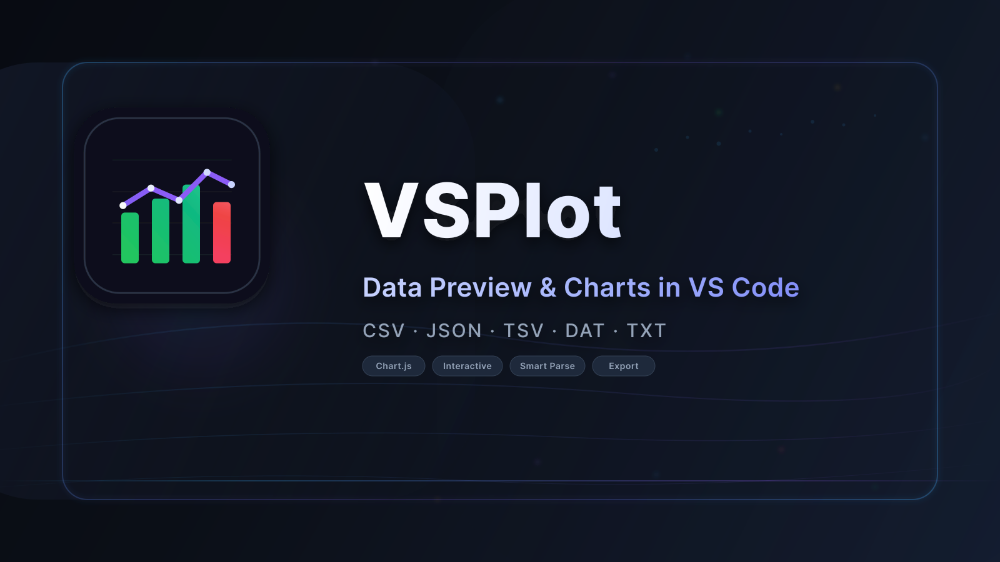
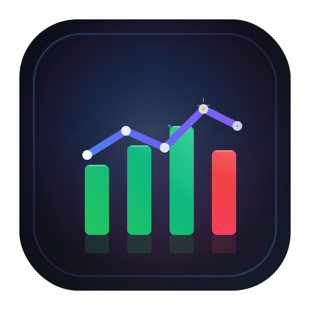

<p align="center">
  <a href="https://marketplace.visualstudio.com/items?itemName=anselmhahn.vsplot">
    
  </a>
</p>

<h1 align="center">VSPlot — Data preview & charts inside VS Code</h1>

<p align="center"><em>Turn CSV, JSON, TSV, DAT, and scientific flat files into filterable tables and interactive Chart.js dashboards without leaving the editor.</em></p>

<p align="center">Created by <a href="https://github.com/Anselmoo">Anselm Hahn</a> • Looks best with <a href="https://marketplace.visualstudio.com/items?itemName=AnselmHahn.caligo-vscode-theme"><code>caligo-vscode-theme</code></a></p>

<p align="center">
  <a href="https://github.com/Anselmoo/vsplot/actions/workflows/release.yml"></a>
  <a href="https://codecov.io/gh/Anselmoo/vsplot"></a>
  <a href="https://github.com/Anselmoo/vsplot/blob/main/LICENSE"></a>
  <a href="https://marketplace.visualstudio.com/items?itemName=anselmhahn.vsplot"></a>
  <a href="https://marketplace.visualstudio.com/items?itemName=anselmhahn.vsplot"></a>
</p>

<p align="center">
  <a href="https://marketplace.visualstudio.com/items?itemName=anselmhahn.vsplot"></a>
  <a href="https://github.com/Anselmoo/vsplot/blob/main/docs/WEBVIEW_ARCHITECTURE.md"></a>
  <a href="https://github.com/Anselmoo/vsplot/blob/main/CHANGELOG.md"></a>
</p>

<p align="center">
  
</p>

---

## Why VSPlot?

- **Instant insight:** Preview large tabular files in a dedicated webview with search, sorting, pagination, stats, and row selection tailored for data exploration.
- **Chart.js built-in:** Launch the chart builder directly from the preview, apply aggregations, dual axes, zooming, and style presets — all powered by Chart.js v4.
- **Smart parsing:** Auto-detects delimiters, skips comment lines, and gracefully handles inconsistent columns so you keep working instead of cleaning data first.
- **Stays in sync:** Webviews remember layout preferences, compact cards, icon toggles, and chart configuration per file to keep your workspace focused.
- **Fits your workflow:** Works from Explorer, text editor context menus, or command palette, and ships with sample datasets for rapid demos.

## Quickstart: preview → chart in under a minute

1. **Install VSPlot** from the [Marketplace](https://marketplace.visualstudio.com/items?itemName=Anselmoo.vsplot) or search "VSPlot" inside VS Code.
2. **Open or right-click a data file** (`.csv`, `.json`, `.tsv`, `.dat`, `.tab`, `.out`, `.data`, `.txt`) and choose **Preview Data**.
3. **Filter, search, and sort** within the preview webview, then press the **Create Chart** button in the toolbar to open the Chart view beside it.
4. Pick an X axis, up to two Y axes, adjust aggregation/zoom presets, and export the chart as a PNG. Need to go back to the data grid? Hit the new **Preview Data** button inside Chart view to jump right back without leaving the webview stack.

## Development & Linting

This project uses **Biome** for linting and formatting. Run locally:

```bash
# Run linting
npm run lint

# Auto-format files
npm run format
```

See `CONTRIBUTING.md` for Husky and lint-staged setup and CI behaviour.
> 💡 Need sample datasets? Run `bash scripts/setup-test-data.sh` (or use the downloaded archives) and open anything under `sample-data/` to explore the UI immediately.

## Preview data in seconds

- **Column-aware filtering:** Search across columns, toggle sort order, and paginate large files without waiting.
- **Row-level insight:** Select specific rows to recompute statistics (count, min, max, mean, median, stddev) on the fly.
- **Delimiter overrides:** Switch delimiters from the toolbar (`Auto`, `,`, `|`, `;`, `:`, `\t`, space) and the view reparses instantly.
- **Export Data button:** Save exactly what is visible (including filters) to CSV for sharing or downstream analysis.


## Build interactive charts with Chart.js

- **Multiple chart types:** Line, bar, scatter, pie, doughnut, and radar with presets for color palettes and number formatting.
- **Dual-axis & aggregation:** Plot metrics on primary and secondary Y axes, aggregate categorical data (sum, count, avg, min, max), and switch between linear/time scales.
- **Zoom & navigate:** Scroll-wheel zoom, drag zoom without modifier keys (plus a fallback drag box), arrow-key panning for both axes, and a quick ↺ reset button that reapplies the current configuration.
- **Round-trip workflow:** A dedicated **Preview Data** button in Chart view reopens the original data preview so you can tweak filters and regenerate charts without re-running commands.
- **Stateful experience:** VSPlot remembers the last configuration per file and exposes hidden `vsplot:test:*` commands for automated workflows.
- **Export ready:** Save charts as high-resolution PNGs directly from the webview.


## Works with the formats you already have

| Extension                       | Default delimiter            | Notes                                                |
| ------------------------------- | ---------------------------- | ---------------------------------------------------- |
| `.csv`                          | Comma (auto-detect fallback) | Respects quoted fields and comment filtering.        |
| `.json`                         | —                            | Parses arrays of objects or key/value maps.          |
| `.tsv` / `.tab`                 | Tab                          | Defaults to tab delimiter, can override.             |
| `.txt`, `.dat`, `.out`, `.data` | Auto-detected                | Evaluates comma, pipe, semicolon, colon, tab, space. |

**Comment markers:** `#`, `%`, and `//` are ignored by default. Provide custom markers or disable filtering through the API.

## Smart parsing extras

- Consistency scoring picks the delimiter with the richest, most stable column layout (see [Delimiter Detection](docs/DELIMITER_DETECTION.md)).
- Mixed whitespace, BOM headers, and uneven rows are handled gracefully; malformed lines trigger friendly error toasts.
- API consumers can override delimiter and comment options via `parseDataFile(uri, { delimiter, commentMarkers })`.

## Fine-tune the experience

| Setting                     | Default | Description                                                |
| --------------------------- | ------- | ---------------------------------------------------------- |
| `vsplot.rowsPerPage`        | `150`   | Rows to display per page in the preview view.              |
| `vsplot.defaultChartType`   | `line`  | Initial chart type in the Chart view.                      |
| `vsplot.defaultStylePreset` | `clean` | Color palette for new charts (`clean`, `soft`, `vibrant`). |
| `vsplot.defaultDecimals`    | `2`     | Numeric precision for axes and tooltips (0, 1, 2).         |
| `vsplot.useThousands`       | `false` | Toggle thousands separator by default.                     |
| `vsplot.compactStatsCards`  | `false` | Use tighter spacing in statistics cards.                   |
| `vsplot.showStatsIcons`     | `true`  | Show icons/badges in stats and dataset cards.              |

## Commands at a glance

| Command              | Palette ID              | What it does                                                   |
| -------------------- | ----------------------- | -------------------------------------------------------------- |
| **Preview Data**     | `vsplot.previewData`    | Opens the data preview webview for the selected file.          |
| **Plot Data**        | `vsplot.plotData`       | Skips straight to Chart view with parsed data.                 |
| **Open Data Viewer** | `vsplot.openDataViewer` | Presents a quick pick of supported files across the workspace. |

Access commands via the Explorer context menu, the editor title bar, or the Command Palette (`⇧⌘P` / `Ctrl+Shift+P`).

## Try it with bundled sample data

- `sample-data/` includes CSV, JSON, DAT, TSV, and time-series examples generated by `scripts/setup-test-data.sh`.
- `test-data/` holds fixtures for delimiter detection and comment handling — perfect for validating parser changes or demos showing resilience.

## Docs & resources

- [Webview architecture](docs/WEBVIEW_ARCHITECTURE.md) — how providers load HTML templates and inject nonces.
- [Delimiter detection](docs/DELIMITER_DETECTION.md) — scoring algorithm and override flow.
- [Comment handling](docs/COMMENT_HANDLING.md) — default markers and API hooks.
- [Testing coverage](docs/TESTING_COVERAGE.md) — suites for parsing, edge cases, and extension automation.

Need help or have a request? [Open an issue](https://github.com/Anselmoo/vsplot/issues) or start a discussion in the repository.

## Release notes & contributing

- Track releases in [`CHANGELOG.md`](CHANGELOG.md).
- Contributions are welcome! Please read [`CONTRIBUTING.md`](CONTRIBUTING.md) for setup, coding standards, and release flow.

## Privacy

VSPlot does **not** collect telemetry. All parsing and visualization runs locally within your VS Code session.

---

### Developers

Clone the repo, install dependencies, and compile the extension:

```bash
npm install
npm run compile
```

Run the extension in the VS Code Extension Development Host (press `F5`), or execute the automated test suite:

```bash
npm test
```

Before packaging, refresh Chart.js bundles with `npm run copy-vendor` to ensure the webviews ship the latest vendor files.

---

## Works best with Caligo

<p align="center">
  <a href="https://marketplace.visualstudio.com/items?itemName=AnselmHahn.caligo-vscode-theme">
    
  </a>
</p>

VSPlot is designed to look its best with [**Caligo**](https://github.com/Anselmoo/caligo-vscode-theme) — a professional dark-theme collection for VS Code built on **OKLCH color science**. Caligo ships **50 perceptually uniform themes** (10 seed palettes × 5 harmony modes) with semantic highlighting, APCA-validated contrast, and mathematically harmonious colors that keep your editor — and your data previews — easy on the eyes.

```
code --install-extension AnselmHahn.caligo-vscode-theme
```

[Install from Marketplace](https://marketplace.visualstudio.com/items?itemName=AnselmHahn.caligo-vscode-theme) · [Live Gallery](https://anselmoo.github.io/caligo-vscode-theme/#/gallery) · [GitHub](https://github.com/Anselmoo/caligo-vscode-theme)
