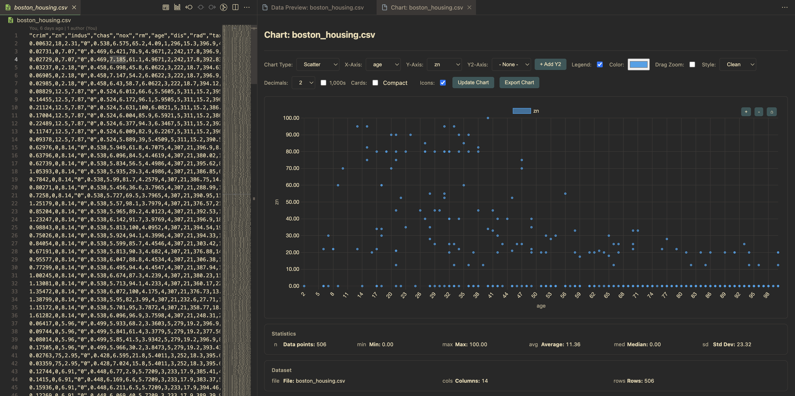

# VSPlot — Data Preview and Charts in VS Code

Preview and visualize CSV/JSON/TXT/DAT directly in VS Code. Explore tables with search/sort/pagination, then build interactive charts with zoom, drag-zoom, aggregation, and multiple axes.

## Features

- Data Preview:
  - Search, sort, pagination, row selection
  - Delimiter auto-detection with override (comma, pipe, tab, space, etc.)
  - Comment line filtering (skips lines starting with #, %, //)
  - Export filtered rows to CSV
  - Stats panel with count/min/max/avg/median/stddev
  - Compact cards and small badges toggles
  - “Create Chart” from current filtered data
- Chart View (Chart.js v4):
  - Chart types: line, bar, scatter, pie, doughnut, radar
  - Axis selectors, legend toggle, color picker
  - Zoom in/out/reset + drag-zoom fallback
  - Aggregation for categorical X (sum, count, avg, min, max)
  - Multiple Y axes (Y2) for line/bar/scatter
  - Number formatting (decimals, thousands), style presets
  - Stats + dataset meta cards; compact and icons toggles

## Usage

- Explorer context menu:
  - “Preview Data” for `.csv`, `.json`, `.txt`, `.dat`
  - “Plot Data” for `.csv`, `.json`
- From Data Preview: use “Create Chart” to open Chart View with filtered rows.

## Commands

- `vsplot.previewData` — Preview Data
- `vsplot.plotData` — Plot Data
- `vsplot.openDataViewer` — Open Data Viewer

## Settings

- `vsplot.defaultChartType` (line|bar|scatter|pie)
- `vsplot.rowsPerPage` (default 150)
- `vsplot.defaultStylePreset` (clean|soft|vibrant)
- `vsplot.defaultDecimals` (0|1|2)
- `vsplot.useThousands` (boolean)
- `vsplot.compactStatsCards` (boolean)
- `vsplot.showStatsIcons` (boolean)

## Screenshots

Images must be PNG/JPG. The repo includes generated assets under `images/`.

## Release Notes

See [`CHANGELOG.md`](CHANGELOG.md) for full history.

## Contributing

Contributions are welcome! See [`CONTRIBUTING.md`](CONTRIBUTING.md) for setup, coding standards, and release flow.

## License

MIT — see [`LICENSE`](LICENSE) for details.

---

No telemetry is collected by this extension.
