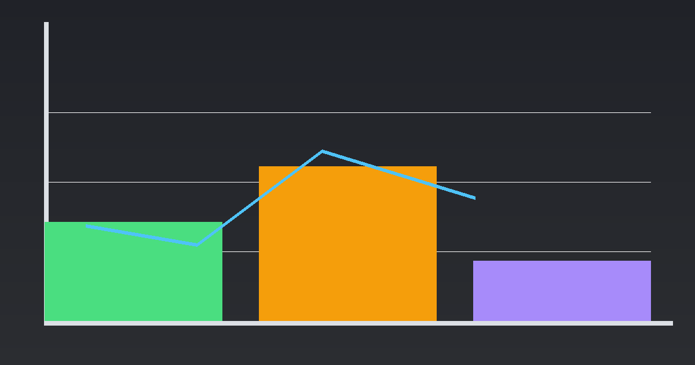
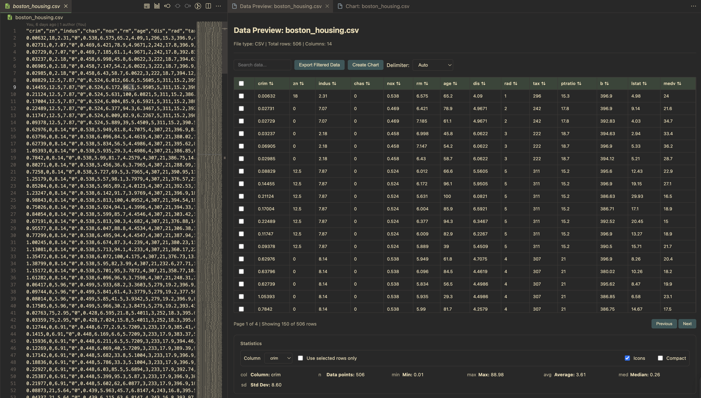

# VSPlot — Data Preview and Charts in VS Code

Preview and visualize CSV/JSON/TXT/DAT directly in VS Code. Explore tables with search/sort/pagination, then build interactive charts with zoom, drag-zoom, aggregation, and multiple axes.

## Features

- Data Preview:
  - Search, sort, pagination, row selection
  - Delimiter auto-detection with override (comma, pipe, tab, space, etc.)
  - Comment line filtering (skips lines starting with #, %, //)
  - Export filtered rows to CSV
  - Stats panel with count/min/max/avg/median/stddev
  - Compact cards and small badges toggles
  - “Create Chart” from current filtered data
- Chart View (Chart.js v4):
  - Chart types: line, bar, scatter, pie, doughnut, radar
  - Axis selectors, legend toggle, color picker
  - Zoom in/out/reset + drag-zoom fallback
  - Aggregation for categorical X (sum, count, avg, min, max)
  - Multiple Y axes (Y2) for line/bar/scatter
  - Number formatting (decimals, thousands), style presets
  - Stats + dataset meta cards; compact and icons toggles

## Supported Formats

VSPlot supports the following file formats with automatic parsing:

### File Extensions
- **CSV** (`.csv`) - Comma-separated values with optional comment filtering
- **JSON** (`.json`) - Standard JSON data files
- **TXT** (`.txt`) - Text files with auto-detected delimiters
- **DAT** (`.dat`) - Data files with auto-detected delimiters
- **TSV** (`.tsv`) - Tab-separated values (auto-defaults to tab delimiter)
- **TAB** (`.tab`) - Tab-delimited files
- **OUT** (`.out`) - Output files with auto-detected delimiters
- **DATA** (`.data`) - Generic data files with auto-detected delimiters

### Supported Delimiters
The parser automatically detects the following delimiters (or you can manually override):
- **Comma** (`,`) - Standard CSV format
- **Pipe** (`|`) - Common in database exports
- **Semicolon** (`;`) - Common in European CSV files
- **Colon** (`:`) - Used in some configuration files
- **Tab** (`\t`) - Standard for TSV/TAB files
- **Space** (` `) - Common in scientific data files

### Comment Line Support
By default, VSPlot filters out lines starting with these comment markers:
- **Hash** (`#`) - Common in scripting languages and data formats
- **Percent** (`%`) - Common in MATLAB, LaTeX, statistical formats
- **Double Slash** (`//`) - Common in C-style languages

Comment markers can be customized programmatically via the API.

### Documentation
- [Supported Formats Reference](docs/SUPPORTED_FORMATS.md) - Comprehensive format, delimiter, and feature documentation
- [Comment Handling Guide](docs/COMMENT_HANDLING.md) - Detailed comment filtering documentation
- [Delimiter Detection Guide](docs/DELIMITER_DETECTION.md) - Auto-detection algorithm and manual overrides

### Example Data Files
Sample data files demonstrating all features are available in `sample-data/` and `test-data/` directories. Run `bash scripts/setup-test-data.sh` to generate them.

## Usage

- Explorer context menu:
  - “Preview Data” for `.csv`, `.json`, `.txt`, `.dat`, `.tsv`, `.tab`, `.out`, `.data`
  - “Plot Data” for `.csv`, `.json`
- From Data Preview: use “Create Chart” to open Chart View with filtered rows.

## Commands

- `vsplot.previewData` — Preview Data
- `vsplot.plotData` — Plot Data
- `vsplot.openDataViewer` — Open Data Viewer

## Settings

- `vsplot.defaultChartType` (line|bar|scatter|pie)
- `vsplot.rowsPerPage` (default 150)
- `vsplot.defaultStylePreset` (clean|soft|vibrant)
- `vsplot.defaultDecimals` (0|1|2)
- `vsplot.useThousands` (boolean)
- `vsplot.compactStatsCards` (boolean)
- `vsplot.showStatsIcons` (boolean)

## Screenshots

Images must be PNG/JPG. The repo includes generated assets under `images/`.

## Release Notes

See [`CHANGELOG.md`](CHANGELOG.md) for full history.

## Contributing

Contributions are welcome! See [`CONTRIBUTING.md`](CONTRIBUTING.md) for setup, coding standards, and release flow.

## License

MIT — see [`LICENSE`](LICENSE) for details.

---

No telemetry is collected by this extension.
